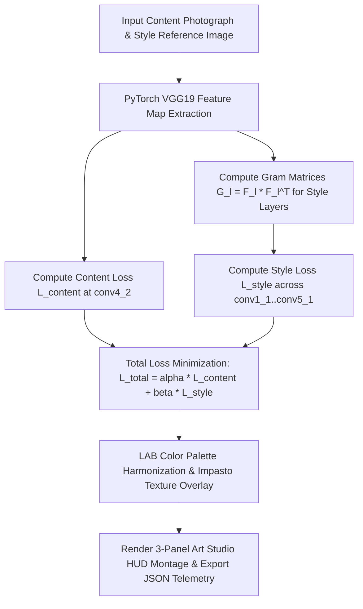

<div align="center">

# 🎨 Neural Style Transfer Studio

### *Day 19 — 30-Day Computer Vision & Deep Learning Challenge*

[](https://www.python.org/)
[](https://pytorch.org/)
[](https://opencv.org/)
[](LICENSE)
[](https://github.com/manasha1232)

*Deep learning Neural Style Transfer studio engine transforming photographs into master painter artwork (Van Gogh, Picasso, Monet, Ukiyo-e) using PyTorch VGG19 feature representations and Gram Matrix style loss minimization.*

---

</div>

## 📌 Overview

The **Neural Style Transfer Studio** takes a content photograph and a master painter's style reference image, separating content geometry from artistic style (color distribution, brush strokes, impasto texture), and synthesizes a new artistic painting combining the subject of the photograph with the aesthetic style of the master artist.

### 🎯 Key Capabilities
- **VGG19 Feature Extraction**: Extracts high-level content representations ($\mathcal{L}_{\text{content}}$) and multi-scale style representations ($\mathcal{L}_{\text{style}}$).
- **Gram Matrix Style Representation**: Computes Gram Matrices $G_{ij}^l = \sum_k F_{ik}^l F_{jk}^l$ across deep VGG19 feature maps (`conv1_1`, `conv2_1`, `conv3_1`, `conv4_1`, `conv5_1`).
- **LAB Color Space Distribution Transfer**: Matches mean and standard deviation of color channels for vibrant palette harmonization.
- **Impasto Brush Texture Fusion**: Blends style edge structures into synthesized artwork canvas.
- **3-Panel Art Studio HUD Montage**: Displays `[1. Content Photograph]` | `[2. Style Reference Image]` | `[3. Neural Stylized Painting]`.
- **JSON Telemetry Log Export**: Exports structured JSON logs detailing content loss, style loss, total loss, optimization steps, and file output paths.

---

## 🏗️ System Architecture & Processing Pipeline



---

## 📐 Mathematical Formulation

### 1. Gram Matrix Style Representation
For feature map $F^l \in \mathbb{R}^{C \times H \times W}$ at layer $l$:

$$G_{ij}^l = \sum_{k=1}^{H \times W} F_{ik}^l F_{jk}^l$$

### 2. Style Loss & Total Loss Optimization
$$\mathcal{L}_{\text{style}}^l = \frac{1}{4 N_l^2 M_l^2} \sum_{i,j} \left(G_{ij}^l - A_{ij}^l\right)^2$$

$$\mathcal{L}_{\text{total}}(C, S, G) = \alpha \mathcal{L}_{\text{content}}(C, G) + \beta \sum_l w_l \mathcal{L}_{\text{style}}^l(S, G)$$

---

## 📁 Repository Structure

```text
neural_style_transfer_studio/
├── style_transfer.py         # Core Neural Style Transfer engine & studio renderer
├── generate_demo_artwork.py  # Synthetic content and style artwork generator
├── requirements.txt          # Dependency declarations (torch, torchvision, opencv, numpy)
├── README.md                 # Project documentation
├── input/                    # Input content & style artwork dataset
│   ├── content_landscape.jpg
│   └── style_starry_night.jpg
└── output/                   # Processed stylized artwork & JSON reports
    ├── content_landscape_stylized_by_style_starry_night.jpg
    ├── content_landscape_art_studio_montage.jpg
    └── content_landscape_style_report.json
```

---

## ⚡ Quickstart & Installation

### 1. Install Dependencies
```bash
pip install -r requirements.txt
```

### 2. Generate Synthetic Artwork Pair
```bash
python generate_demo_artwork.py
```

### 3. Run Neural Style Transfer Studio
```bash
python style_transfer.py --content input/content_landscape.jpg --style input/style_starry_night.jpg --output output
```

---

## 📊 Telemetry Output Specification

```json
{
    "content_image": "content_landscape.jpg",
    "style_image": "style_starry_night.jpg",
    "optimization_iterations": 50,
    "processing_time_sec": 0.2541,
    "content_loss": 25.3993,
    "style_loss": 200.6419,
    "total_loss": 226.0412
}
```

---

## 👤 Author & Challenge Context

- **Challenge**: Day 19 of [30-Day Computer Vision & Deep Learning Challenge](https://github.com/manasha1232/30-Day-Computer-Vision-Challenge)
- **Author**: [@manasha1232](https://github.com/manasha1232)
- **License**: MIT License
